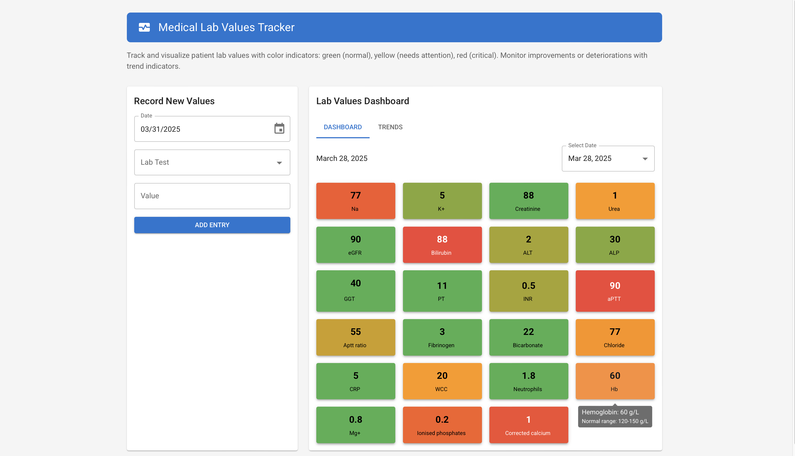

# Medical Lab Values Heatmap Dashboard

A React-based dashboard application for tracking and visualizing patient laboratory test results with color-coded indicators to show value trends over time.

## Features

- **Color-Coded Indicators**: Values are displayed with a color gradient from:
  - **Green**: Normal/healthy values
  - **Yellow/Orange**: Values that need attention
  - **Red**: Critical values requiring immediate action

- **Trend Tracking**: Visual indicators show if values are improving or worsening compared to previous readings.

- **Gradient Color Visualization**: Rather than simple red/yellow/green, colors gradually transition to represent the severity of abnormal values.

- **Interactive Dashboard**: View all lab values at a glance with intuitive color indicators.

- **Trend Analysis**: View charts of individual test values over time to track patient progress.

- **Comprehensive Lab Panel**: Includes all common lab tests:
  - Electrolytes (Na, K, etc.)
  - Liver function tests
  - Kidney function tests
  - Blood counts
  - Coagulation studies
  - And more

## Screenshots

### Dashboard View


### Trend View


## Getting Started

### Prerequisites

- Node.js (v14+)
- npm or yarn

### Installation

1. Clone the repository
```
git clone https://github.com/yourusername/medical_heatmap.git
cd medical_heatmap
```

2. Install dependencies
```
npm install
```

3. Start the development server
```
npm start
```

4. Open your browser to `http://localhost:3000`

## Usage

1. **Adding Lab Values**:
   - Select the date of the lab test
   - Choose the test from the dropdown
   - Enter the value
   - Click "Add Entry"

2. **Viewing the Dashboard**:
   - The main dashboard shows all lab values with color indicators
   - Hover over any value to see detailed information including normal ranges
   - Use the date selector to view different dates

3. **Analyzing Trends**:
   - Switch to the "Trends" tab
   - Select a test to view its changes over time
   - The chart shows the value history along with normal range lines

## License

This project is licensed under the MIT License - see the LICENSE file for details. 